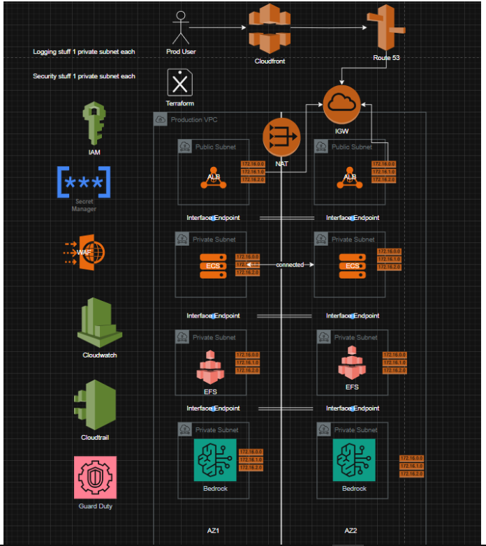

# SafeGenAI - TikTok Tech Jam 2025

## Project Overview

**SafeGenAI** is an advanced privacy-preserving AI chat application designed to address the growing concerns about data privacy and security in AI systems. Built for the TikTok Tech Jam 2025 under Topic 7: Privacy for AI, SafeGenAI implements cutting-edge privacy-preserving techniques to ensure user data remains secure while providing powerful AI-driven conversational capabilities.

### Problem Statement

As AI technologies rapidly integrate into our daily lives, concerns about privacy and security have become more urgent than ever. With the rise of powerful generative AI models, large-scale data collection, and cloud-based deployment, users face increasing risks: sensitive data leakage, identity theft, and unauthorized access to personal information. This project explores solutions for enhancing the privacy of AI systems themselves, ensuring that sensitive user data is protected throughout the entire AI processing pipeline.

### Features and Functionality

SafeGenAI addresses privacy concerns through multiple layers of protection:

**Data Privacy & Anonymization**

- Real-time PII (Personally Identifiable Information) detection and alias-aware anonymization using Microsoft Presidio
- Advanced entity recognition with fuzzy matching and semantic similarity
- Reversible anonymization for maintaining conversational context

**Homomorphic Encryption**

- Secure computation on encrypted data using Pyfhel (SEAL)
- BFV encryption scheme with 128-bit security level
- Enables AI processing while data remains encrypted

**Intelligent Document Processing**

- RAG (Retrieval-Augmented Generation) capabilities for context-aware responses
- FAISS-powered vector similarity search for efficient document retrieval
- Support for multiple file formats (PDF, TXT, DOCX) with secure processing

**Advanced AI Integration**

- Google Gemini 2.5 Flash LLM for natural language processing
- Sentence Transformers for semantic embeddings
- State machine-based processing pipeline for reliable execution

**Performance & Scalability**

- Redis caching for optimal response times
- Docker containerization for easy deployment
- Server-Sent Events (SSE) for real-time streaming responses

**Security Measures**

- CORS configuration and request validation
- File upload security with type and size validation
- Comprehensive error handling and logging

### Development Tools Used

**Frontend Development:**

- **Vite** - Modern build tool for fast development
- **TypeScript** - Type-safe JavaScript development
- **ESLint** - Code quality and consistency
- **Autoprefixer** - CSS vendor prefixing
- **PostCSS** - CSS processing

**Backend Development:**

- **Docker & Docker Compose** - Containerization and orchestration
- **Flask** - Python web framework
- **Python 3.10+** - Core programming language

**Testing & Quality:**

- **Vitest** - Unit testing framework
- **Coverage reporting** - Code coverage analysis

### APIs Used in the Project

**AI & Machine Learning APIs:**

- **Google Gemini 2.5 Flash** - Large Language Model for chat responses
- **LangChain** - LLM orchestration and chaining
- **LangGraph** - Agent-based AI workflows
- **Hugging Face Transformers** - Pre-trained model access
- **Sentence Transformers** - Semantic embeddings

**Privacy & Security APIs:**

- **Microsoft Presidio** - PII detection and anonymization
- **Pyfhel (SEAL)** - Homomorphic encryption operations
- **SpaCy** - Natural language processing

**Infrastructure APIs:**

- **Redis** - Caching and session management

### Assets Used in the Project

**UI Assets:**

- **Lucide React** - Modern icon library
- **Custom CSS animations** - Smooth user interactions
- **Tailwind CSS utilities** - Responsive design components

**Font Assets:**

- **System fonts** - Optimized typography stack
- **Font loading optimization** - Performance-focused font delivery

### Libraries Used in the Project

**Frontend Libraries:**

- **React 18.2.0** - Component-based UI library
- **React DOM 18.2.0** - DOM rendering for React
- **Tailwind CSS** - Utility-first CSS framework
- **Tailwind Merge** - Conditional class merging
- **clsx** - Conditional className utility

**Backend Python Libraries:**

- **Flask 3.1.2** - Web application framework
- **Pydantic 2.11.7** - Data validation and settings
- **SQLAlchemy 2.0.43** - Database ORM
- **Redis 6.4.0** - In-memory data structure store
- **NumPy 2.2.6** - Numerical computing
- **SciPy 1.15.3** - Scientific computing
- **Cryptography 44.0.3** - Cryptographic primitives

**AI & ML Libraries:**

- **LangChain 0.3.32** - LLM application framework
- **LangGraph 0.6.6** - Agent workflow management
- **Transformers 4.55.4** - Hugging Face transformers
- **Sentence Transformers 5.1.0** - Semantic embeddings
- **Presidio Analyzer 2.2.359** - PII detection
- **Presidio Anonymizer 2.2.359** - Data anonymization
- **Pyfhel** - Homomorphic encryption (SEAL wrapper)
- **SpaCy 3.8.7** - Natural language processing
- **Scikit-learn 1.7.1** - Machine learning utilities

**Utility Libraries:**

- **PyMuPDF 1.26.4** - PDF processing
- **python-dotenv 1.1.1** - Environment variable management
- **Pillow 11.3.0** - Image processing
- **PyYAML 6.0.2** - YAML configuration parsing
- **Requests 2.32.5** - HTTP client library
- **RapidFuzz 3.13.0** - Fast string matching

SafeGenAI represents a comprehensive solution to AI privacy challenges, combining state-of-the-art privacy-preserving technologies with user-friendly design to create a secure and efficient AI chat experience.

## How it works

- **Step 1** - The user provides context (files or text) and enters a query in the respective input boxes.
- **Step 2** - Personally Identifiable Information (PII) is detected and anonymized using the alias-aware anonymization engine.
- **Step 3** - The anonymized context is encrypted using the homomorphic encryption engine.
- **Step 4** - Semantic embeddings of the anonymized context are stored in the vector database, while the encrypted context is stored in the local Redis cache. This separation ensures embeddings and raw encrypted data are kept distinct.
- **Step 5** - The anonymized query is embedded into vectors, which are used to retrieve the most relevant context_ids from the vector database. These IDs are then used to fetch the corresponding encrypted context from Redis.
- **Step 6** - The encrypted context is decrypted back into its anonymized form.
- **Step 7** - The anonymized query and anonymized context are passed to the cloud LLM for processing.
- **Step 8** - The LLM response is de-anonymized using the saved entity mappings.
- **Step 9** - The final, de-anonymized response is returned to the user.

## Future Deployment Plans

SafeGenAI is designed with scalability and enterprise deployment in mind. The following cloud infrastructure architecture demonstrates our planned production deployment strategy using AWS services across multiple availability zones for high availability and security.



The proposed AWS architecture leverages a multi-tier approach with dedicated security zones. User traffic flows through CloudFront CDN and Route 53 for global distribution and DNS management. The application layer utilizes ECS with Application Load Balancers (ALB) across multiple availability zones (AZ1 and AZ2) for fault tolerance. Critical components include EFS for shared file storage, Bedrock for AI model hosting, and comprehensive security measures with IAM identity management, CloudWatch monitoring, CloudTrail audit logging, and GuardDuty threat detection. This infrastructure ensures SafeGenAI can scale to handle enterprise workloads while maintaining the highest standards of data privacy and security. They are also isolated in different subnets and the ALB will have ingress and egress access to the internet via the internet gateway through a public subnet and the private subnets will communicate between themselves via respective interface endpoints or the NAT gateway if the components need to update their packages.

## API Documentation

### Chat Endpoint

**POST** `/api/v1/chat`

The main endpoint for processing chat requests with privacy-preserving features.

#### Request

**Headers:**

- `Content-Type`: `application/json` or `multipart/form-data`
- `X-Correlation-ID` (optional): Request correlation ID for tracking

**Body Parameters:**

| Parameter      | Type   | Required | Description                                             |
| -------------- | ------ | -------- | ------------------------------------------------------- |
| `prompt`       | string | Yes      | User's chat message or question                         |
| `context`      | string | No       | Additional context for the conversation                 |
| `context_file` | file   | No       | File upload for document-based context (PDF, TXT, DOCX) |

#### Privacy Features

The `/api/v1/chat` endpoint implements several privacy-preserving features:

1. **PII Anonymization**: Automatically detects and anonymizes personally identifiable information using Microsoft Presidio
2. **Homomorphic Encryption**: Encrypts sensitive data while allowing computations to be performed
3. **Secure Document Processing**: Validates and securely processes uploaded files
4. **Context Isolation**: Maintains conversation context while protecting user privacy

#### Processing Pipeline

The chat endpoint follows this privacy-preserving processing pipeline:

1. **Input Validation**: Validates prompt and file uploads
2. **PII Detection**: Scans input for personally identifiable information
3. **Anonymization**: Replaces PII with anonymized tokens
4. **Encryption**: Encrypts anonymized data using homomorphic encryption
5. **RAG Context Retrieval**: Retrieves relevant context_ids from vector database, and their respective encrypted context from redis cache
6. **Decryption**: Decrypts retrieved context into its anonymised version for LLM Processing
7. **LLM Processing**: Generates response using Google Gemini 2.5 Flash
8. **De-anonymization**: Restores original context while maintaining privacy
9. **Response**: Returns processed response to client

## Project Structure

```
.
├── .env                          # Environment variables
├── .env.docker                   # Docker environment variables
├── .env.example                  # Environment template
├── .gitignore                    # Git ignore rules
├── docker-compose-dev.yml        # Development Docker configuration
├── docker-compose-llm.yml        # LLM service Docker configuration
├── docker-compose-prod.yml       # Production Docker configuration
├── DOCUMENTATION.md              # This documentation
├── main.py                       # Main AI service entry point
├── README.md                     # Quick start guide
├── requirements.txt              # Python dependencies for main service
├── backend/                      # Flask backend service
├── frontend/                     # React frontend application
```

## Backend Architecture and Common Components

The backend implements a sophisticated architecture with enterprise-grade patterns and practices. The [`backend/src/common/`](backend/src/common/) folder contains the foundational components that power the entire system.

### Dependency Injection System

#### [`DIContainer`](backend/src/common/container.py)

The application uses a custom-built dependency injection container that provides:

- **Singleton Registration**: Services registered once and reused throughout the application lifecycle
- **Transient Registration**: Factory-based service creation for stateless components
- **Type-Safe Resolution**: Strongly-typed service resolution with compile-time guarantees
- **Lifecycle Management**: Automatic cleanup and resource management
- **Circular Dependency Prevention**: Built-in detection and prevention of circular dependencies

The DI container supports both singleton and transient service lifetimes, allowing for efficient resource utilization while maintaining clean separation of concerns.

#### Application Factory Pattern

The [`app_factory.py`](backend/src/common/app_factory.py) implements the factory pattern for Flask application creation, integrating:

- **Configuration Loading**: Environment-based configuration management
- **CORS Setup**: Cross-origin resource sharing configuration for frontend communication
- **Middleware Registration**: Automatic registration of common middleware components
- **Service Registration**: Dependency injection container setup and service registration
- **Blueprint Registration**: Modular route registration through Flask blueprints

### State Machine Implementation

#### Core State Machine Engine

The [`StateMachine`](backend/src/common/statemachine/statemachine.py) class provides a robust, generic state machine implementation with:

- **Type-Safe Transitions**: Generic type parameters ensure compile-time safety
- **Event-Driven Architecture**: Clean separation between state, events, and handlers
- **Handler Execution**: Automatic execution of transition handlers with error handling
- **Validation**: Built-in validation of state transitions and events
- **Debugging Support**: Comprehensive logging and introspection capabilities

#### Chat State Machine

The chat processing workflow is managed by a specialized state machine in [`chat_state_machine.py`](backend/src/common/statemachine/chat/chat_state_machine.py) with states:

- **PENDING**: Initial request validation
- **VALIDATED**: File and prompt validation completed
- **ANONYMISED**: PII detection and anonymization completed
- **PROCESSED**: LLM processing completed
- **DEANONYMISED**: Response deanonymization completed
- **SUCCESS**: Processing completed successfully
- **FAILURE**: Error state for failed processing

#### State Machine Events

The [`ChatStatusEvent`](backend/src/common/statemachine/chat/chat_state_machine_events.py) enum defines all possible state transitions:

- **Validation Events**: VALIDATE_SUCCESS, VALIDATE_FAILURE
- **Anonymization Events**: ANONYMISE_SUCCESS, ANONYMISE_FAILURE
- **Processing Events**: PROCESS_SUCCESS, PROCESS_FAILURE
- **Deanonymization Events**: DEANONYMISE_SUCCESS, DEANONYMISE_FAILURE
- **Completion Events**: COMPLETE_SUCCESS

#### State Machine Handlers

The [`ChatStateHandlers`](backend/src/common/statemachine/chat/chat_state_machine_handlers.py) class provides specialized handlers for each transition:

- **Logging Handlers**: Comprehensive state transition logging with correlation IDs
- **Validation Handlers**: File and prompt validation success/failure handling
- **Privacy Handlers**: Anonymization and deanonymization process handling
- **Processing Handlers**: LLM processing lifecycle management
- **Error Handlers**: Graceful error handling and recovery mechanisms

Each handler includes:

- Context management for session tracking
- Timestamp recording for audit trails
- Error message propagation
- Structured logging with session and message IDs

### Validator Chain System (Chain of Responsibility)

#### Validator Chain Implementation

The [`ValidatorChain`](backend/src/common/validators/) implements the Chain of Responsibility pattern for request validation:

- **Composable Validation**: Multiple validators can be chained together
- **Early Termination**: Validation stops at first failure for performance
- **Error Aggregation**: Option to collect all validation errors
- **Reusable Components**: Validators can be reused across different chains
- **Contextual Validation**: Validators can access request context for conditional logic

#### Chat Validators

The [`chat_validators.py`](backend/src/chat/validators/chat_validators.py) module provides specialized validators:

- **PromptValidator**: Validates message content length, format, and content policy
- **FileValidator**: Validates file types, sizes, and content
- **FilesListValidator**: Validates collections of files and aggregate constraints
- **ChatValidatorChain**: Composite validator for complete request validation

#### Validation Features

- **File Type Validation**: MIME type checking and extension validation
- **Size Constraints**: Configurable file size limits
- **Content Scanning**: Basic content validation for security
- **Format Validation**: Structured data format validation
- **Business Rule Validation**: Application-specific validation rules

### Middleware and Interceptors

#### Correlation ID Middleware

The [`CorrelationIdMiddleware`](backend/src/common/middlewares/) provides:

- **Request Tracking**: Unique ID generation for each request
- **Cross-Service Tracing**: Correlation ID propagation across service boundaries
- **Debugging Support**: Enhanced logging with request correlation
- **Performance Monitoring**: Request lifecycle tracking

#### Global Exception Filter

The [`GlobalExceptionFilter`](backend/src/common/filters/) implements:

- **Centralized Error Handling**: Single point for all application exceptions
- **Structured Error Responses**: Consistent error format across all endpoints
- **Error Classification**: Different handling for different error types
- **Security**: Sensitive information filtering in error responses
- **Monitoring Integration**: Error metrics and alerting integration

#### Logger Interceptor

The [`logger_interceptor.py`](backend/src/common/interceptors/logger_interceptor.py) provides:

- **Structured Logging**: JSON-formatted logs with consistent structure
- **Performance Logging**: Request/response timing and performance metrics
- **Security Logging**: Authentication and authorization event logging
- **Debug Information**: Detailed logging for development and troubleshooting

### Configuration Management

#### Configuration Loader

The [`config`](backend/src/common/config/) module provides:

- **Environment-Based Configuration**: Different configs for dev/staging/production
- **Type-Safe Configuration**: Strongly-typed configuration classes
- **Validation**: Configuration validation at startup
- **Default Values**: Sensible defaults for optional configuration
- **Secret Management**: Secure handling of sensitive configuration data

#### Configuration Features

- **Database Configuration**: Connection strings, pool settings, timeouts
- **Redis Configuration**: Cache settings, connection parameters
- **Security Configuration**: JWT settings, encryption keys, CORS policies
- **Application Configuration**: Feature flags, service URLs, timeouts
- **Logging Configuration**: Log levels, formats, destinations

### Exponential Backoff and Retry Logic

#### Retry Mechanisms

The common utilities include sophisticated retry mechanisms with:

- **Exponential Backoff**: Increasing delay between retry attempts
- **Jitter**: Random variation to prevent thundering herd problems
- **Circuit Breaker**: Automatic failover when services are unavailable
- **Dead Letter Queue**: Failed request queuing for manual intervention
- **Timeout Management**: Configurable timeouts for different operations

#### Retry Strategies

- **Database Operations**: Automatic retry for transient database failures
- **External API Calls**: Retry logic for LLM and external service calls
- **File Processing**: Retry mechanisms for file upload and processing
- **Cache Operations**: Fallback strategies when cache is unavailable

### Utilities and Helper Functions

#### File Converter

The [`FileConverter`](backend/src/common/utils/file_converter.py) provides:

- **Multi-Format Support**: Conversion between various file formats
- **Content Extraction**: Text extraction from PDFs, documents, and images
- **Metadata Preservation**: File metadata handling and preservation
- **Error Handling**: Graceful handling of corrupt or unsupported files
- **Memory Management**: Efficient handling of large files

## Frontend Application

### Overview

The frontend is a modern React application built with TypeScript and Vite, featuring:

- Modern UI with dark theme
- File upload support with drag & drop functionality
- Server-Sent Events (SSE) for real-time streaming responses
- Responsive design with mobile-first approach
- Full TypeScript support for type safety
- Comprehensive testing with Vitest and React Testing Library

### Supported File Types

- Text files (.txt, .md, .csv, .json)
- Images (.jpg, .jpeg, .png, .gif, .webp)
- Documents (.pdf, .doc, .docx)
- Maximum file size: 10MB per file

### API Integration

The frontend communicates with the backend via RESTful APIs with Server-Sent Events for streaming responses.

#### File Validation

Client-side file validation using [`file-validation.ts`](frontend/src/utils/file-validation.ts) provides immediate feedback before upload.

## Security and Privacy Features

### Data Privacy

- **PII Detection**: Automatic detection of personally identifiable information
- **Data Anonymization**: Real-time anonymization of sensitive data
- **Homomorphic Encryption**: Computation on encrypted data without decryption

### Security Measures

- **CORS Configuration**: Proper cross-origin resource sharing setup
- **Environment Variables**: Secure configuration management
- **Request Correlation**: Tracking and logging for debugging and monitoring

### File Upload Security

- **File Type Validation**: Client and server-side file type checking
- **Size Limits**: Maximum 10MB per file to prevent abuse
- **Content Scanning**: Validation of file contents for security
